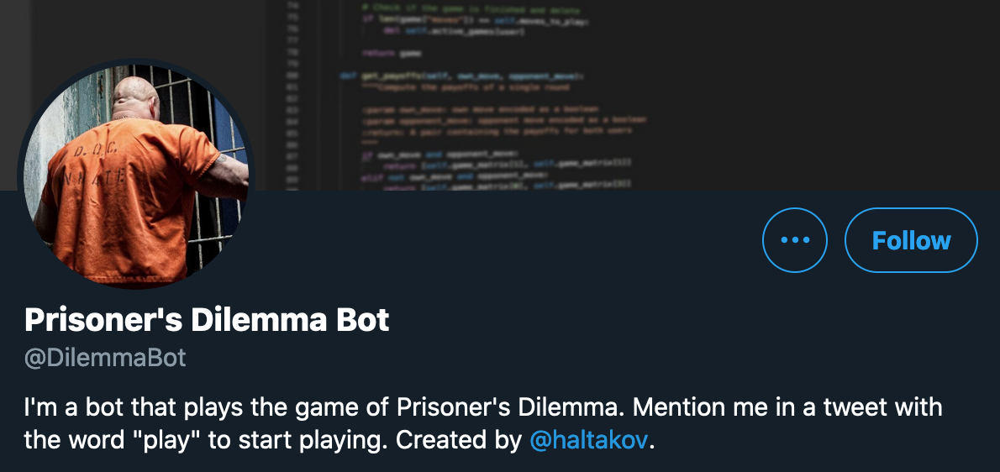
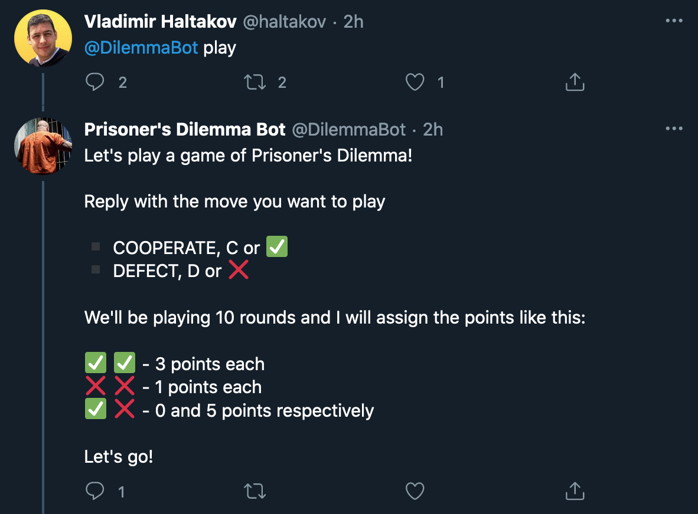
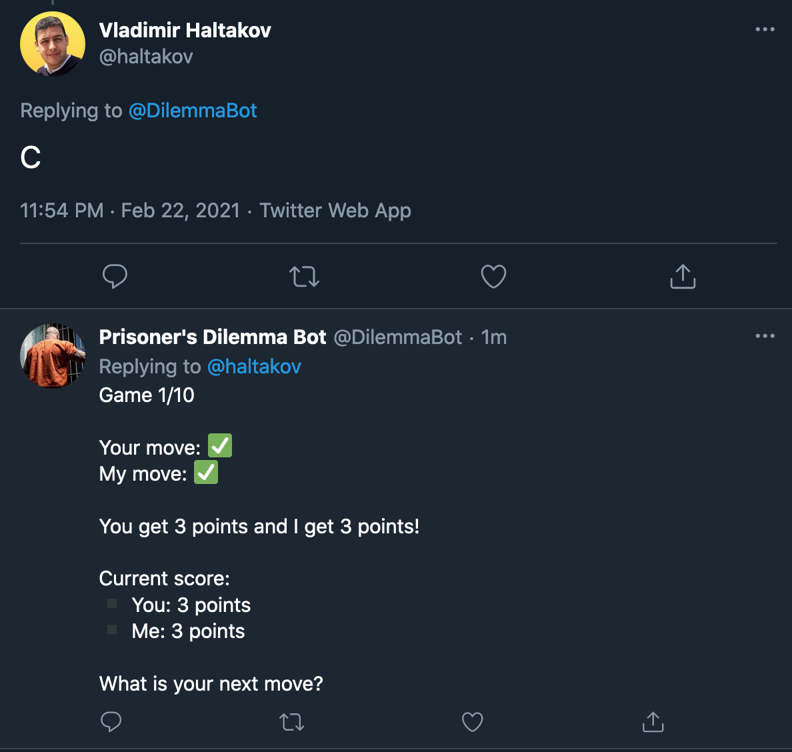

# Prisoner's Dilemma Twitter Bot

This is a Twitter bot that plays the game of (Iterated) [Prisoner's Dilemma](https://en.wikipedia.org/wiki/Prisoner%27s_dilemma) created by [Vladimir Haltakov](https://twitter.com/haltakov). The interface to the bot is implemented using tweets and replies. The bot is deployed on Twitter [@DilemmaBot](https://twitter.com/DilemmaBot).

<a href="https://twitter.com/DilemmaBot"></a>

## How It Works

1. The bot uses the Twitter Search API to listen for mentions of its Twitter handle @DilemmaBot.
2. When mentioned together with the word "play" in the text, it will start a new game and reply with the rules.
3. When the user replies with their move (either "cooperate" or "defect"), the bot plays as well and replies with the outcome and the current score.
4. The bot will play 10 rounds of the Prisoner's Dilemma game and store the results in a file.

### Starting a new game



### Making a move



## How to Deploy the Bot

This section explains how you can deploy the bot yourself.

## Strategy

The bot currently plays the [tit-for-tat strategy](https://en.wikipedia.org/wiki/Tit_for_tat). It will always start cooperating and will then copy the opponents last move.

New strategies can be easily implemented using an abstracted interface.

### Run the bot

1. Create a file `.env` in the root folder containing you Twitter API tokens

```
API_KEY=xxx
API_SECRET=yyy
ACCESS_TOKEN=zzz
ACCESS_TOKEN_SECRET=uuu
```

2. Create a Python virual environment and source it

```
python3 -m venv .venv
source .venv/bin/activate
```

3. Install the requirements

```
pip3 install -r requirements.txt
```

4. Run the Twitter client

```
export PYTHONPATH="."
python3 prisonersdilemma/twitter_client.py
```

### Configure the bot

Run the Twitter cliend with the `-h` option to get a detailed usage instructions.

### Bot artifacts

The bot will create several files containing its state (if you need to stop it and start it again) and some statistics:

-   `twitter_bot_state.json` - the last tweet ID that the bot replied to. This is important to avoid replying twice to a tweet and to speed up the search.
-   `active_games.json` - dictionary specifying the games that the bot is currently playing
-   `twitter_bot.log` - log file dump
-   `archive.json` - list of completed games

## About Prisoner's Dilemma

For more information about the game of Prisoner's Dilemma check out [this thread](https://twitter.com/haltakov/status/1361439744018812929).
